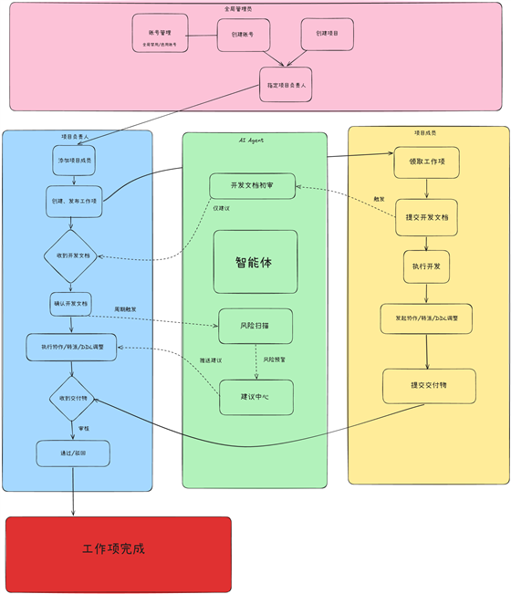
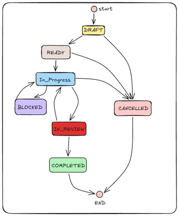
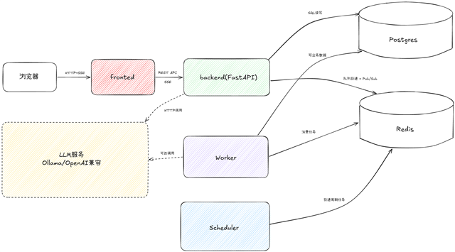
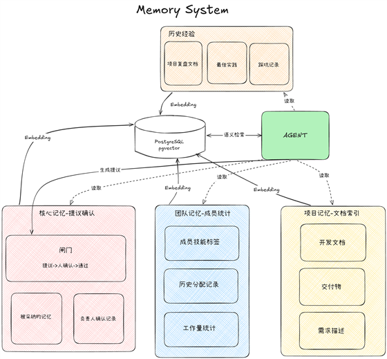

# AgentOS

面向小团队的多项目 AI 协作工作流平台。

**AI 只提建议，人做决定。** Agent 不直接修改任何正式业务状态——所有关键流转（审批、审核、状态迁移）都由具备权限的成员确认。平台把成员、工作项、协作、审批、交付物搬进同一个可留痕的系统，Agent 在关键节点提供需求拆解、人员推荐、风险提示和初审建议。

## 为什么需要它

小团队常见的两个困境：

1. **任务流转靠聊天群和表格**。谁在做什么、卡在哪里、谁审批过什么，散落在群消息里，事后无从追溯。
2. **全自动 AI 工具不可控**。让 AI 直接改数据很危险，但完全不接入 AI 又浪费了它的分析能力。

AgentOS 的答案是：**流程平台管留痕，AI 管建议**。业务状态以 PostgreSQL 为准，Agent 的每条建议都记录在案、可采纳可拒绝，关键操作全部追加式审计、不可覆盖。

## 快速开始

[点击此链接，快速开始你的第一次团队协作](docs/QuicklyStart.md)

## 功能总览

- **多项目与权限隔离**：用户可参与多个项目，登录后选择进入；成员、工作项、审批、交付物、通知、审计与 Agent 建议均按项目隔离。
- **平台管理控制台**：全局管理员独立于项目成员体系，负责账号、项目、项目负责人与平台审计管理。
- **项目成员管理**：每个项目仅一名负责人，可添加账号、维护成员资料与能力标签、启用或停用成员。
- **AI 需求拆解**：自然语言需求 → Agent 结构化分析 → 拆分工作项并推荐负责人 → 预填表单确认后批量创建。
- **工作项全流程**：草稿、待开始、进行中、阻塞、审核、完成等状态；主执行人唯一，协作、转派、DDL 变更走申请与审批。
- **开发文档前置**：成员开工前提交开发文档，AI 初审 + 负责人确认后才能进入开发，必要时负责人可豁免。
- **交付与审核**：Git 链接（GitHub/Gitee/GitLab 的 PR/MR/Commit，含格式校验）、文本、文件三类交付物版本化提交，负责人最终审核。
- **知识库与记忆**：项目文档索引检索、成员档案统计、核心记忆（Agent 提议 + 负责人确认）、知识库问答（RAG）。
- **工作台与团队概览**：个人待办、项目统计、团队任务状态、成员负载、通知与审计时间线。
- **Agent 建议中心**：七类建议：需求分析、任务规划、人员推荐、开发文档初审、交付初审、进展摘要、周期风险扫描，支持查看与采纳闭环。
- **审计、备份与恢复**：关键写操作追加审计记录；提供 PostgreSQL 与上传目录的备份、恢复、校验脚本。

## 核心工作流



1. **全局管理员**在控制台创建业务账号，创建项目并指定负责人。
2. **项目负责人**添加项目成员，维护能力与可用工时，创建并发布工作项。
3. **项目成员**认领工作项，提交开发文档（AI 初审 + 负责人确认），执行过程中可发起协作、转派、DDL 变更申请。
4. 任务完成后提交交付物（Git 链接 / 文本 / 文件），**负责人**进行最终审核（通过 / 要求修改 / 拒绝）。
5. **Agent** 在关键事件与周期扫描中生成建议，进入建议中心，由人工决定是否采纳。

### 工作项状态机



草稿 → 待开始 → 进行中 → 提交审核 → 完成；进行中可标记阻塞并解除；审核不通过退回进行中重新提交；草稿、待开始、进行中阶段可取消任务。所有迁移由后端状态机校验，非法迁移返回 409。

## 系统架构



Docker Compose 一键编排六个服务：

六个服务：`frontend`（前端应用）、`backend`（API 服务）、`worker`（异步任务处理）、`scheduler`（定时任务）、`postgres`（业务数据库与向量存储）、`redis`（缓存与队列）。

Agent 层基于 LangGraph 五节点基础图 + PostgreSQL 检查点，通过 httpx 直连模型服务（本地 Ollama 默认，兼容 OpenAI 接口），不引入 LangChain。LLM 不可用时 Agent 运行记录失败并指数退避重试，核心业务流程不受影响。

> \[!TIP]
> Agent 只有读取类工具和一条建议提交通道，没有修改工作项、审批、交付物的任何工具——这是平台安全模型的底线，由测试套件持续守护。

## 记忆模块



让 Agent 越用越懂项目，四层记忆各司其职：

| 层     | 内容             | 来源                  |
| ----- | -------------- | ------------------- |
| 项目记忆  | 项目文档的向量化索引与检索  | 成员上传的文档，自动分块嵌入      |
| 团队记忆  | 成员能力标签、历史工作量统计 | 工作流数据自动沉淀           |
| 核心记忆  | 项目的关键约定与决策     | Agent 提议 + 负责人确认后生效 |
| 历史与经验 | 已完成任务的复盘沉淀     | 任务闭环时生成             |

所有记忆通过 pgvector（1024 维）统一索引，支撑知识库问答页面；核心记忆严格走"提议—确认"通道，与业务建议同级管控。

## 环境变量

完整配置及注释见 [.env.example](.env.example) 和 [发布指南](docs/release-guide.md)。关键配置包括：

| 配置                                   | 用途                    |
| ------------------------------------ | --------------------- |
| `JWT_SECRET`                         | JWT 签名密钥，生产环境必须使用强随机值 |
| `POSTGRES_PASSWORD` / `DATABASE_URL` | PostgreSQL 凭据与连接地址    |
| `BOOTSTRAP_ADMIN_*`                  | 首次启动时幂等创建的全局管理员       |
| `BOOTSTRAP_PROJECT_NAME`             | 首次启动时幂等创建的默认项目        |
| `LLM_PROVIDER` / `LLM_MODEL`         | Agent 使用的模型提供方与模型     |
| `OLLAMA_BASE_URL`                    | 容器访问宿主机 Ollama 的地址    |
| `OPENAI_COMPATIBLE_*`                | OpenAI 兼容模型服务地址与密钥    |
| `EMBEDDING_*`                        | 记忆模块向量化配置             |
| `STORAGE_ROOT` / `UPLOAD_*`          | 本地文件存储目录和上传限制         |

## 项目结构

```text
backend/    FastAPI 模块化单体、领域服务、Agent、Worker、Scheduler 与 Alembic 迁移
frontend/   src/features 按业务功能组织，src/components/ui 为 shadcn/ui 组件
deploy/     备份与恢复脚本
docs/       总体设计、架构指南、专项设计、发布说明与质量基线
data/       PostgreSQL、Redis、上传文件、日志和备份等运行时数据（勿提交）
```

## 角色边界

| 角色    | 主要职责                                     |
| ----- | ---------------------------------------- |
| 全局管理员 | 创建和停用账号、创建项目、指定或变更项目负责人、查看平台审计；不参与项目业务协作 |
| 项目负责人 | 管理本项目成员、工作项、审批与审核；确认或拒绝 Agent 建议与记忆提议    |
| 项目成员  | 在所属项目内执行工作项、发起协作、提交开发文档与交付物              |

同一普通账号可以加入多个项目，并在不同项目中拥有独立的成员身份、角色和能力信息。

## 文档索引

- [总体设计](docs/2026-07-26-agentos-workflow-platform-design.md)
- [架构指南](docs/architecture-guide.md)
- [发布、部署与迁移指南](docs/release-guide.md)
- [备份与恢复脚本说明](deploy/scripts/README.md)
- [快速开始](docs/QuicklyStart.md)

## 当前限制

- 暂无 SSO 与即时通讯工具集成。
- Git 支持仅限交付链接的格式校验与规范化（GitHub/Gitee/GitLab 的 PR/MR/Commit），尚未接入 Git 平台 API，无法读取仓库状态或自动关联提交。
- 暂无用户自助修改或重置密码入口；初始密码需要在创建账号时安全设置和转交。
- 上传文件使用本地目录存储，尚未接入 S3 等对象存储。
- Agent 只生成建议，不直接修改工作项、审批、交付物等正式业务状态。
- Docker Compose 是当前主要部署方式，尚未提供 Kubernetes 部署清单。

