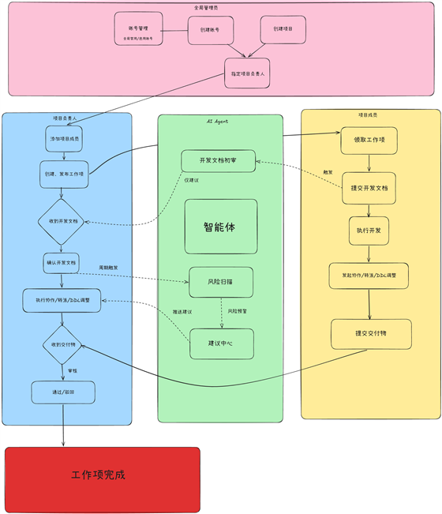

# AgentOS

**让需求、协作与交付有据可查，让 AI 在团队流程中提供帮助。**

AgentOS 是面向小型研发团队的多项目 AI 协作平台。它将需求管理、任务分配、协作审批、开发文档、交付审核和项目知识库连接起来，帮助团队从一段需求描述推进到可验收的成果，而不必反复在聊天记录、任务表格和零散文档之间核对进度。

在 AgentOS 中，负责人可以借助 AI 拆解需求、规划任务并推荐执行人；成员围绕工作项提交方案、发起协作和交付成果；审批、转派、改期与审核保留操作记录。项目文档、成员档案和历史经验也能进入检索与记忆流程，为后续分析提供上下文。

**AI 提建议，人做决定。** Agent 负责分析、推荐、初审和风险提示，不直接替用户创建工作项、批准申请或确认完成。关键业务操作始终由有权限的人确认，模型不可用时，人工协作流程仍可继续。

适合同时推进多个项目、需要明确责任与交付标准，并希望将 AI 引入日常协作而保留人工决策权的团队。支持自托管，可连接本地 Ollama 或 OpenAI 兼容模型服务。

[快速启动](#快速启动) · [架构指南](docs/architecture-guide.md) · [部署与运维](docs/release-guide.md)

## 核心功能

### 从需求到可执行任务

集中管理项目需求、讨论和素材。AI 辅助分析目标、约束与验收要求，提出任务拆解和人选建议；负责人修改并确认后创建工作项，将分析结果落实到具体执行人。

### 有责任归属的团队协作

每个工作项有明确的主执行人，支持协作请求、转派、截止时间变更和成果移交。工作台、通知与时间线汇总进展，审批和状态流转保留记录，便于追踪谁负责、哪里受阻、哪些决定已经确认。

### 从开发方案到交付审核

开工前提交开发文档，由负责人确认或豁免，AI 提供初审意见。完成后可提交 Git 链接、文本或文件交付物，保留版本并接受审核；需要修改时反馈给执行人，避免把“已提交”直接等同于“已验收”。

### 嵌入业务节点的 AI 助手

围绕需求分析、任务规划、人员推荐、文档与交付初审、进展摘要及风险扫描提供建议。建议关联运行记录和业务上下文，用户可以查看、采纳或忽略，而不是将模型输出直接写成业务结论。

### 可检索、可积累的项目知识

上传项目文档后进行索引，通过 RAG 问答检索资料并查看回答依据。成员档案、历史任务与项目核心记忆为 Agent 提供参考；AI 提炼的经验先形成提议，由负责人确认后成为生效的核心记忆。

### 多项目隔离与自托管

全局管理员管理账号和项目，负责人管理项目协作，同一成员可以参与多个项目。业务数据按项目校验权限，文件支持本地或 MinIO 存储，并提供数据库与文件的备份恢复工具。

## 工作流程

1. **整理需求**：录入需求与资料，借助 AI 分析并确认任务拆解。
2. **安排执行**：确定主执行人和验收要求，提交开发方案并完成开工确认。
3. **协作交付**：推进任务，按规则处理协作、转派和改期，提交版本化成果。
4. **审核沉淀**：完成审核或成果接收，保留过程记录，将资料与经验用于后续检索和分析。



## 快速启动

需要 Docker、Compose 插件及 Buildx 0.17+。在仓库根目录执行：

```bash
cp -n .env.example .env
```

编辑 `.env`，设置 `JWT_SECRET`、`BOOTSTRAP_ADMIN_PASSWORD`、`POSTGRES_PASSWORD`，并同步 `DATABASE_URL` 中的密码。AI 与检索功能需另行配置文本模型和 `EMBEDDING_*` 服务，详见[发布指南](docs/release-guide.md)。

```bash
docker compose up -d --build
```

- Web：http://localhost:3000
- API 文档：http://localhost:8000/docs

首次使用 `BOOTSTRAP_ADMIN_*` 指定的管理员登录，创建业务账号并为项目指定负责人。更改引导密码配置不会重置已有账号密码。

**对外部署前收紧端口并配置 HTTPS：当前 PostgreSQL 发布到 `0.0.0.0:5436`，Web 与 API 也发布到宿主机。`data/` 保存持久化数据，请勿随意删除。**

## 开发与测试

技术栈：React + TypeScript、FastAPI、PostgreSQL + pgvector、Redis、LangGraph。

后端要求 Python 3.12+，依赖统一声明在 `backend/pyproject.toml`；前端建议 Node.js 20+。以下命令从仓库根目录执行：

```bash
# 后端测试，仅在隔离的开发或测试环境运行
docker compose up -d postgres redis
docker compose build backend
docker compose run --rm --no-deps -v "./backend:/app" backend python -m pytest tests/ -q

# 前端测试与构建
npm --prefix frontend ci
npm --prefix frontend test
npm --prefix frontend run build
```

后端测试会创建并清理专用 `_test` 数据库，Redis 默认使用 DB 15；不要连接生产资源。

## 文档

- [架构指南](docs/architecture-guide.md)：模块划分、权限、Agent 与记忆机制。
- [发布指南](docs/release-guide.md)：配置、部署、存储迁移、备份恢复与故障排查。
