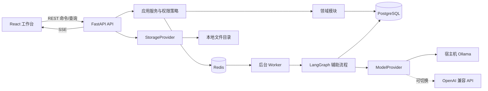
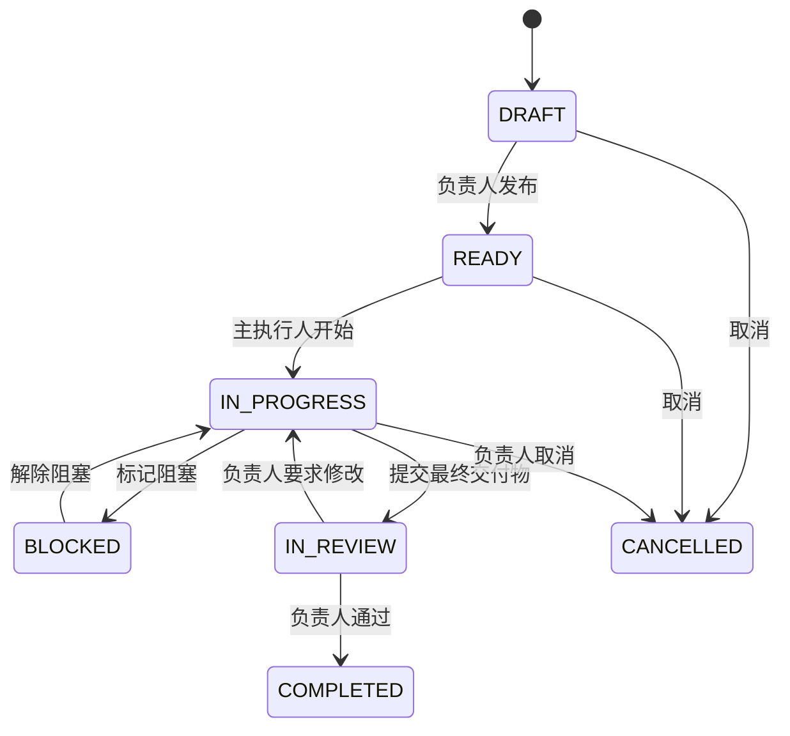
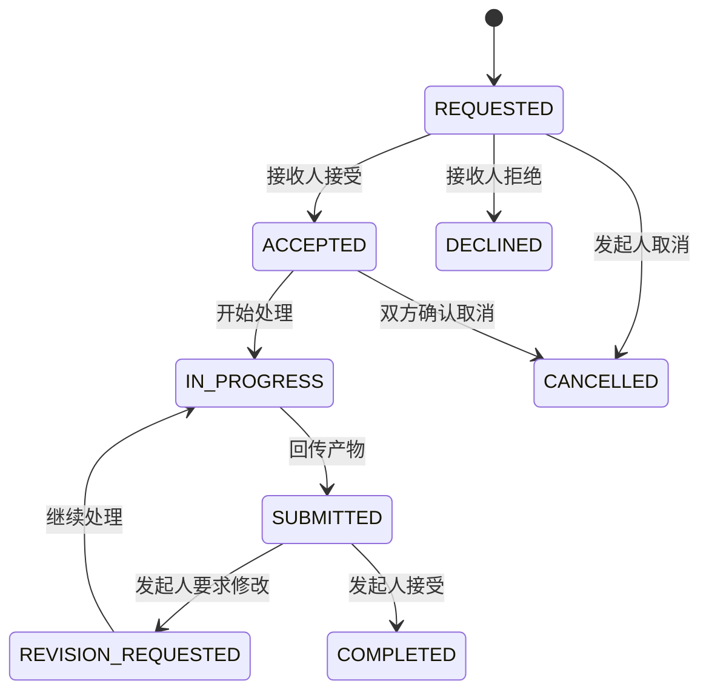
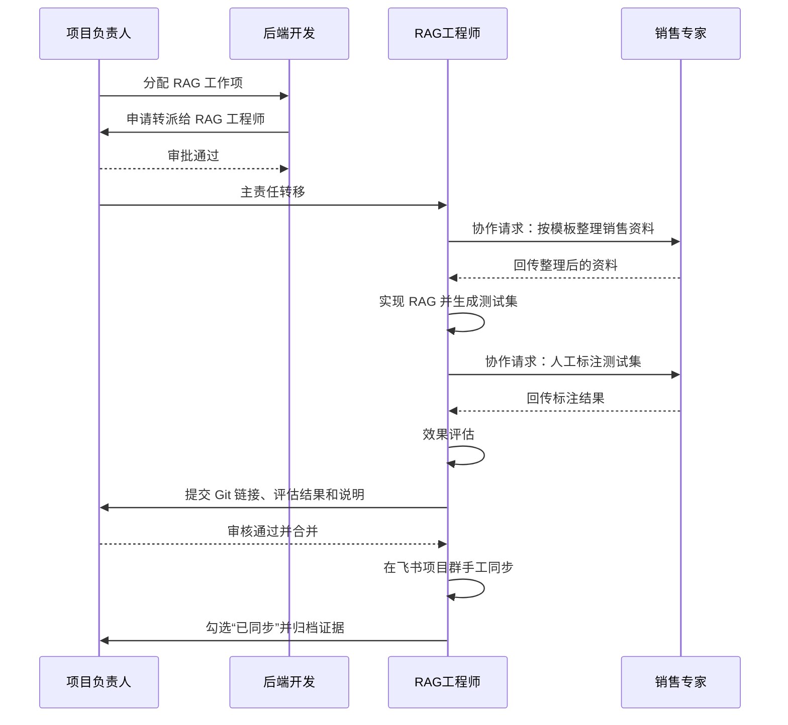
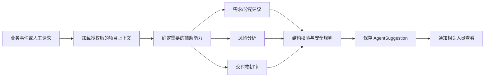

# AgentOS 单项目智能协作与留痕平台设计

- 日期：2026-07-26
- 状态：待用户评审
- 目标环境：Debian Linux
- 架构路线：工作流优先的模块化单体

## 1. 项目目标

AgentOS 用于解决小型项目团队内部职责边界不清、任务在成员之间动态流转、资料和交付物缺少统一记录、负责人无法及时掌握进度的问题。

系统围绕一个固定项目建设。负责人创建顶层工作项并指定初始负责人；成员可以发起协作请求、提交交付物、申请调整截止时间。主任务转派和影响主任务截止时间的变更由项目负责人审批。全部分配、转派、请求、回传、审核和通知动作形成不可覆盖的审计记录。

AI Agent 是辅助决策者，不是业务流程的控制者。Agent 可以分析需求、推荐负责人、建议任务和截止时间、识别风险、辅助审核交付物并生成总结，但不能自行分配任务、批准转派、修改截止时间、通过审核或合并代码。

## 2. MVP 范围

### 2.1 首版包含

- 本地账号密码登录。
- 项目负责人创建、禁用和维护成员。
- 项目内角色、能力标签、熟练度和可投入时间管理。
- 项目内透明工作台；所有成员均可查看全员工作量、当前工作状态、任务标题、负责人和截止时间。
- 顶层工作项创建、分配、开始、阻塞、提交审核、驳回、完成和取消。
- 每个工作项只有一名主执行人，可以有多名协作者。
- 成员直接发起协作请求，不需要项目负责人事前审批。
- 主任务转派申请及项目负责人审批。
- 协作请求截止时间由双方协商；影响主任务截止时间时提交负责人审批。
- Git 链接、文本说明和本地文件作为交付物。
- 文件版本、哈希、提交人、提交时间和关联任务留痕。
- 项目负责人最终审核。
- Agent 建议、风险提示、交付物初审和项目总结。
- 站内通知、待办中心和完整事件时间线。
- PostgreSQL、Redis 和本地文件持久化。
- Docker Compose 标准开发与部署方式。

### 2.2 首版不包含

- 多项目、多租户和公司级组织架构。
- 飞书、GitHub、GitLab、Gitee 等外部系统 API 集成。
- 企业 SSO。
- Agent 自动改变任务或审批状态。
- 可视化通用流程设计器。
- MinIO 或云对象存储。
- 复杂工时、薪酬和绩效计算。

这些能力通过明确的适配器和领域边界预留演进空间，但不进入 MVP 实现范围。

## 3. 核心设计原则

1. **业务状态以 PostgreSQL 为准。** Redis、LangGraph 检查点和模型输出不能替代业务记录。
2. **人类决定，Agent 建议。** Agent 输出必须以独立建议记录保存，人工确认后才调用业务命令。
3. **动态协作，不预设固定岗位流水线。** 工作项在执行过程中通过转派和协作请求形成真实关系。
4. **主责任唯一。** 一个工作项只有一名当前主执行人，协作者不承担最终交付责任。
5. **任何关键动作可追溯。** 状态改变与审计事件在同一个数据库事务中写入。
6. **项目工作状态透明。** 所有项目成员可以查看全员工作量和任务状态，但透明范围不自动扩展到无关交付文件或审批隐私信息。
7. **模块化单体优先。** 首版保持一个 FastAPI 代码库，通过领域模块隔离职责；Worker 使用同一领域层。
8. **外部系统通过适配器接入。** 业务层不依赖具体模型、文件系统、Git 平台或通知平台。

## 4. 总体架构



### 4.1 FastAPI 模块化单体

FastAPI 后端按领域划分，而不是按技术类型堆叠所有模型和服务：

- `identity`：账号、密码、令牌、成员状态。
- `project`：单项目配置、项目角色和能力标签。
- `work_items`：顶层工作项、状态和当前负责人。
- `collaboration`：协作请求、接受、提交、退回和完成。
- `transfers`：主任务转派申请与审批。
- `deadlines`：截止时间变更和影响分析。
- `deliverables`：Git 链接、文本交付物和文件版本。
- `reviews`：负责人审核及修改意见。
- `audit`：不可覆盖的审计事件。
- `agents`：Agent 运行、建议和反馈。
- `notifications`：站内通知与未来外部通知适配器。

### 4.2 后台 Worker

后台 Worker 与 API 使用同一套领域模型和数据库访问层，但运行在独立进程中。Redis 作为任务队列和调度媒介。Worker 负责：

- LangGraph Agent 运行。
- DDL 风险和依赖影响分析。
- 交付物初审。
- 到期提醒和逾期风险扫描。
- 日报、阶段总结和负责人汇总。

Worker 不能直接调用“批准、转派、完成”等业务命令，只能生成 Agent 建议或通知。

### 4.3 实时更新

前端通过 REST API 提交动作，通过 Server-Sent Events 接收：

- 任务状态变化。
- 新协作请求。
- 待审批事项。
- Agent 分析完成。
- 文件处理完成。
- 到期或逾期提醒。

首版不需要 WebSocket 双向协议；所有写操作仍走可鉴权、可审计的 REST API。

## 5. 推荐仓库结构

```text
AgentOS/
├── backend/
│   ├── app/
│   │   ├── api/
│   │   │   └── v1/
│   │   ├── core/
│   │   ├── domains/
│   │   │   ├── identity/
│   │   │   ├── project/
│   │   │   ├── work_items/
│   │   │   ├── collaboration/
│   │   │   ├── transfers/
│   │   │   ├── deadlines/
│   │   │   ├── deliverables/
│   │   │   ├── reviews/
│   │   │   ├── audit/
│   │   │   └── notifications/
│   │   ├── agents/
│   │   │   ├── graphs/
│   │   │   ├── specialists/
│   │   │   ├── prompts/
│   │   │   └── schemas/
│   │   ├── infrastructure/
│   │   │   ├── database/
│   │   │   ├── cache/
│   │   │   ├── queue/
│   │   │   ├── storage/
│   │   │   ├── models/
│   │   │   └── integrations/
│   │   └── workers/
│   ├── migrations/
│   ├── tests/
│   ├── pyproject.toml
│   └── Dockerfile
├── frontend/
│   ├── src/
│   │   ├── app/
│   │   ├── features/
│   │   │   ├── auth/
│   │   │   ├── dashboard/
│   │   │   ├── members/
│   │   │   ├── work-items/
│   │   │   ├── approvals/
│   │   │   ├── deliverables/
│   │   │   └── agent-assistant/
│   │   ├── components/
│   │   ├── services/
│   │   └── types/
│   ├── tests/
│   ├── package.json
│   └── Dockerfile
├── deploy/
│   ├── nginx/
│   └── scripts/
├── docs/
├── data/
│   ├── uploads/
│   ├── backups/
│   └── logs/
├── docker-compose.yml
├── .env.example
└── README.md
```

`data/`、密钥和本地环境配置不提交 Git。

## 6. 角色、能力与权限

### 6.1 项目角色

首版只保留两个系统角色：

- **项目负责人**
  - 创建和维护成员。
  - 创建和分配顶层工作项。
  - 确认或修改 Agent 建议。
  - 审批主任务转派。
  - 审批影响主任务 DDL 的变更。
  - 最终审核交付物。
  - 查看全部任务、协作和审计记录。
- **项目成员**
  - 查看项目中全部成员的汇总工作量、当前工作状态和工作项摘要。
  - 查看全部工作项的标题、状态、负责人、优先级和截止时间。
  - 接受并执行工作项。
  - 发起协作请求。
  - 提交转派申请和 DDL 变更申请。
  - 提交 Git 链接、文本和文件。
  - 接受或退回发给自己的协作请求。

### 6.2 人员能力模型

每名成员在当前项目中维护：

- 能力标签，例如 RAG、FastAPI、Agent、提示词、测试、销售领域。
- 熟练度，取 1 至 5。
- 每周可投入时间。
- 当前有效任务负载。
- Git 用户名。
- 是否具备审核权限。

管理员或负责人定义项目角色和权限；成员填写能力，负责人确认。Agent 可以根据历史交付给出能力修正建议，但不能自动修改能力或权限。

## 7. 业务对象

### 7.1 工作项

工作项是负责人需要收回最终结果的责任单元，包含：

- 标题、说明、验收标准和优先级。
- 当前唯一主执行人。
- 可选协作者列表。
- 截止时间。
- 当前状态和乐观锁版本号。
- Git 链接、文件或文本交付物。
- 负责人最终审核结果。

### 7.2 协作请求

协作请求由当前工作项负责人发起，用于向其他成员索取资料、标注、评审或局部产物。协作请求：

- 不改变主任务负责人。
- 有独立目标、模板、接收人和截止时间。
- 可以被接受、拒绝、提交或要求修改。
- 产物回传给发起人，并关联原工作项。

### 7.3 转派申请

成员认为任务不属于自己的能力范围时，可以申请将主任务转给另一名成员。转派申请必须包含：

- 当前负责人。
- 建议的新负责人。
- 转派原因。
- 对 DDL 和现有协作请求的影响。
- Agent 生成的能力匹配建议。

项目负责人审批前，主任务负责人不变化；审批通过后才在一个事务中更新负责人并写入审计事件。

### 7.4 DDL 变更

- 协作请求的截止时间由发起人和接收人协商。
- 如果协作 DDL 变化不影响主任务 DDL，可直接确认并留痕。
- 如果会影响主任务 DDL，系统自动生成影响分析并提交项目负责人审批。
- 主任务 DDL 的任何修改都必须由项目负责人批准。

### 7.5 交付物与审核

交付物支持：

- Git 链接。
- 文本说明。
- 本地上传文件。

每次重新提交生成新版本，不覆盖旧版本。项目负责人可以：

- 通过并完成工作项。
- 要求修改并填写反馈。
- 拒绝当前交付但保持工作项继续执行。

## 8. 状态机

### 8.1 工作项状态



### 8.2 协作请求状态



### 8.3 转派申请状态

`PENDING → APPROVED | REJECTED | CANCELLED`

审批通过时才修改 `work_items.assignee_id`。同一工作项同时只能存在一个待审批的转派申请。

### 8.4 DDL 变更申请状态

`PENDING_IMPACT_ANALYSIS → PENDING_APPROVAL → APPROVED | REJECTED | CANCELLED`

Agent 分析失败不阻塞人工审批；系统显示“未生成 AI 影响分析”，负责人仍可基于业务信息决策。

## 9. 真实 RAG 流程映射



其中“后端转给 RAG 工程师”是需要负责人审批的主责任转派；RAG 工程师向销售专家索取资料和标注是无需负责人审批的协作请求。

并行场景表示负责人同时创建多个互不依赖的工作项，例如 RAG 任务和 Agent 工具设计任务。二者由不同成员推进，分别提交和审核，不强制形成同一个内部 DAG。

## 10. Agent 设计

### 10.1 Agent 列表

1. **Requirement Analyst**
   - 将自然语言需求整理为目标、约束、交付物和验收标准。
2. **Assignment Advisor**
   - 根据能力、负载和历史交付推荐初始负责人及候选人。
3. **Planning Advisor**
   - 建议工作项、协作点、DDL 和潜在风险。
4. **Workflow Risk Agent**
   - 识别逾期、阻塞、频繁转派和协作等待风险。
5. **Deliverable Review Agent**
   - 根据验收标准对文本、文件元数据和 Git 提交说明进行初审，生成负责人审核清单。
6. **Summary Agent**
   - 生成项目进展、已完成事项、待审批和风险摘要。

### 10.2 LangGraph 流程



Agent 输出统一为结构化 Pydantic 模型，至少包含：

- 建议类型。
- 建议内容和理由。
- 使用的业务事实引用。
- 置信度。
- 风险和限制。
- 模型、提示词版本和运行 ID。

### 10.3 Agent 权限护栏

Agent 工具只提供只读业务查询和“写入建议”能力。以下操作不注册为 Agent 工具：

- 创建正式工作项。
- 修改负责人。
- 审批转派。
- 修改 DDL。
- 通过审核。
- 删除文件或业务记录。
- 合并代码。

## 11. 数据模型

首版建议使用 SQLAlchemy 2 异步访问、Alembic 迁移和 PostgreSQL UUID 主键。

| 表 | 主要用途 |
|---|---|
| `users` | 账号、密码哈希、启用状态、令牌版本 |
| `projects` | 单项目配置；首版只有一条有效项目记录 |
| `project_members` | 项目角色、显示名、可投入时间、Git 用户名 |
| `member_capabilities` | 能力标签、熟练度和负责人确认状态 |
| `work_items` | 工作项、当前负责人、状态、DDL、乐观锁版本 |
| `work_item_collaborators` | 工作项协作者关系 |
| `collaboration_requests` | 协作请求及独立状态 |
| `transfer_requests` | 主任务转派申请与审批 |
| `deadline_change_requests` | DDL 变更、影响分析和审批 |
| `deliverables` | Git、文本和文件交付物版本 |
| `stored_files` | 存储后端、相对键、大小、类型、哈希 |
| `reviews` | 审核结论、反馈及关联交付物版本 |
| `audit_events` | 追加式业务事件 |
| `agent_runs` | Agent 运行状态、模型、耗时和错误 |
| `agent_suggestions` | 结构化建议及人工采纳结果 |
| `notifications` | 站内通知和已读状态 |
| `refresh_tokens` | Refresh Token 哈希、过期和撤销状态 |

所有核心表包含 `created_at`、`updated_at`；需要并发保护的表包含 `version`。审计事件只允许新增，不允许修改和删除。

## 12. API 设计

API 统一以 `/api/v1` 为前缀。

### 12.1 身份

- `POST /auth/login`
- `POST /auth/refresh`
- `POST /auth/logout`
- `GET /auth/me`

### 12.2 成员

- `GET /members`
- `POST /members`
- `PATCH /members/{id}`
- `PUT /members/{id}/capabilities`

### 12.3 工作项

- `GET /work-items`
- `POST /work-items`
- `GET /work-items/{id}`
- `PATCH /work-items/{id}`
- `POST /work-items/{id}/start`
- `POST /work-items/{id}/block`
- `POST /work-items/{id}/unblock`
- `POST /work-items/{id}/submit`
- `POST /work-items/{id}/cancel`

### 12.4 协作、转派和 DDL

- `POST /work-items/{id}/collaboration-requests`
- `POST /collaboration-requests/{id}/accept`
- `POST /collaboration-requests/{id}/decline`
- `POST /collaboration-requests/{id}/submit`
- `POST /collaboration-requests/{id}/request-revision`
- `POST /collaboration-requests/{id}/complete`
- `POST /work-items/{id}/transfer-requests`
- `POST /transfer-requests/{id}/approve`
- `POST /transfer-requests/{id}/reject`
- `POST /work-items/{id}/deadline-change-requests`
- `POST /deadline-change-requests/{id}/approve`
- `POST /deadline-change-requests/{id}/reject`

### 12.5 交付物、审核和 Agent

- `POST /work-items/{id}/deliverables`
- `POST /files`
- `GET /files/{id}/download`
- `POST /work-items/{id}/reviews`
- `GET /agent-suggestions`
- `POST /agent-suggestions/{id}/feedback`
- `POST /work-items/{id}/agent-analysis`

### 12.6 查询与实时事件

- `GET /dashboard`
- `GET /approvals`
- `GET /audit-events`
- `GET /notifications`
- `POST /notifications/{id}/read`
- `GET /events/stream`

所有会改变状态的接口支持 `Idempotency-Key`。更新接口要求客户端携带版本号，版本冲突返回 HTTP 409。

## 13. 前端设计

前端使用 React、TypeScript 和 Vite。推荐使用 React Router、TanStack Query、轻量全局状态库和适合管理后台的组件库。

### 13.1 负责人页面

- 项目总览：状态分布、即将到期、阻塞和风险。
- 工作项列表：按负责人、状态、DDL 和风险过滤。
- 创建工作项：自然语言需求、Agent 建议和人工确认。
- 审批中心：转派、主任务 DDL 变更和最终审核。
- 成员与能力：能力、负载和可投入时间。
- 项目时间线：所有关键事件和交付物。
- Agent 建议中心：建议、理由、采纳或忽略反馈。

### 13.2 成员页面

- 团队透明看板：查看全员工作量、当前状态、负责人、任务数量和即将到期事项。
- 项目工作项：查看全部工作项的标题、状态、优先级、负责人和截止时间。
- 我的任务：主责任工作项。
- 我的协作：收到和发出的协作请求。
- 待处理：需要接受、提交、修改或确认的事项。
- 任务详情：说明、DDL、协作者、产物、审核、时间线和 Agent 建议。
- 提交交付：Git 链接、文本说明和文件。

### 13.3 真实流转可视化

系统基于已发生的分配、转派和协作事件生成关系图，而不是要求负责人预先绘制流程。默认界面仍以列表、待办和时间线为主，关系图用于理解复杂流转和复盘。

## 14. 文件存储

业务层依赖 `StorageProvider`：

```text
StorageProvider
├── LocalStorageProvider   # MVP
└── S3StorageProvider      # 后续 MinIO、S3 或 OSS
```

首版文件写入配置的本地根目录，数据库仅保存相对 `storage_key`，不保存宿主机绝对路径。下载必须经过 FastAPI 权限检查，禁止直接暴露上传目录。

上传流程：

1. 流式写入临时文件。
2. 校验大小、扩展名和 MIME 类型。
3. 计算 SHA-256。
4. 原子移动到正式目录。
5. 写入 `stored_files` 与审计事件。

未来迁移对象存储时，批量复制文件、校验 SHA-256、更新 `storage_backend` 和 `storage_key`。前端与业务 API 不变化。

## 15. 模型适配

模型通过 `ModelProvider` 接口调用：

- 默认：`ollama`。
- 可选：OpenAI 兼容 API。

主要配置：

```text
LLM_PROVIDER=ollama
LLM_MODEL=<部署时选择的模型>
OLLAMA_BASE_URL=http://host.docker.internal:11434
OPENAI_COMPATIBLE_BASE_URL=
OPENAI_COMPATIBLE_API_KEY=
```

LangGraph 可以使用 LangChain 的模型适配包，但不与 Ollama绑定。业务代码不能直接实例化具体模型客户端。

## 16. 安全与审计

- 密码使用 Argon2 哈希。
- Access Token 短期有效，Refresh Token 以哈希形式持久化并可撤销。
- 项目负责人创建成员账号；首版不开放公开注册。
- 每个 API 用例显式执行项目角色和资源关系校验。
- 文件下载验证当前用户是否与工作项有关，负责人可查看全部文件。
- 全员工作量与状态透明仅开放任务摘要字段；无关成员不能查看交付文件正文、内部审核意见、令牌或敏感配置。
- 日志不记录密码、令牌、API Key 和文件原文。
- 模型只接收完成当前分析所需的最小上下文。
- 使用云端模型时，界面明确提示数据将发送至外部服务。
- `audit_events` 记录操作者、动作、目标、变更前后摘要、请求 ID、时间和来源 IP。

## 17. 错误处理、并发与恢复

### 17.1 API 错误格式

```json
{
  "code": "WORK_ITEM_VERSION_CONFLICT",
  "message": "任务已被其他成员更新，请刷新后重试",
  "request_id": "uuid",
  "details": {}
}
```

### 17.2 并发规则

- 工作项、协作请求和审批使用乐观锁。
- 同一工作项只能有一个待审批转派。
- 同一工作项只能有一个待审批主 DDL 变更。
- 审批接口使用幂等键，重复请求返回第一次结果。
- 文件最终落盘与数据库记录失败时执行补偿清理。

### 17.3 Agent 失败

- 模型超时或不可用不回滚已成功的业务动作。
- Agent 任务按指数退避重试。
- 超过重试次数后记录失败并允许人工重新触发。
- LangGraph 检查点持久化到 PostgreSQL。
- Agent 输出解析失败时保存诊断信息，不保存为正式建议。

## 18. 测试策略

### 18.1 后端

- 领域单元测试：状态机、权限、DDL 影响规则和转派规则。
- API 集成测试：FastAPI、PostgreSQL、Redis 和文件存储。
- 并发测试：重复审批、版本冲突和幂等键。
- Agent 合约测试：结构化输出、模型超时和解析失败。
- 审计测试：每个关键动作必须生成对应事件。

### 18.2 前端

- 组件测试：表单、状态徽标、审批卡片和文件上传。
- 页面集成测试：负责人和成员核心路径。
- 端到端测试：登录、分配、转派、协作、提交、审核和归档。

### 18.3 关键验收场景

以 RAG 流程作为首个端到端验收案例，另增加一个“RAG 与 Agent 工具设计并行执行”的案例。两种场景都必须验证审计事件、通知和 Agent 建议不会改变正式业务状态。

## 19. Debian 开发与部署

### 19.1 宿主机准备

- Debian 64 位系统。
- Git。
- Docker Engine、Buildx 和 Docker Compose Plugin。
- Ollama，以宿主机服务方式运行。
- 快速开发模式额外安装 Node.js LTS、Python 和 `uv`。

### 19.2 Compose 服务

```text
frontend
backend
worker
scheduler
postgres
redis
```

Ollama 不放入 Compose。后端和 Worker 通过 Linux `host-gateway` 访问宿主机 `11434` 端口。

### 19.3 开发模式

- **标准模式**：全部应用服务通过 Docker Compose 运行。
- **快速模式**：PostgreSQL 和 Redis 在 Docker 中运行，React、FastAPI 和 Worker 在宿主机运行。

### 19.4 持久化与备份

```text
data/postgres/
data/redis/
data/uploads/
data/backups/
data/logs/
```

- 每日 PostgreSQL 逻辑备份。
- 每日上传目录增量备份。
- 备份保留周期首版设为 14 天。
- 每月至少执行一次恢复演练。

数据库、Redis 和 Ollama 不对公网开放。正式内部部署只通过反向代理开放 Web 入口。

## 20. 实施阶段

### 阶段 1：工程基础

- Debian 与 Docker Compose 基线。
- FastAPI、React、PostgreSQL、Redis、Worker。
- 数据库迁移、配置、日志和健康检查。

### 阶段 2：身份、成员与工作项

- 登录、令牌和成员管理。
- 能力标签和负载信息。
- 工作项状态机、列表和详情。
- 审计事件基础设施。

### 阶段 3：动态协作

- 协作请求。
- 转派审批。
- DDL 变更及影响审批。
- 站内通知和 SSE。

### 阶段 4：交付与审核

- Git 链接、文本和本地文件。
- 版本、哈希和权限下载。
- 最终审核、修改反馈和完成归档。

### 阶段 5：多 Agent 辅助

- ModelProvider 与 Ollama。
- LangGraph 基础图。
- 需求、分配、风险、初审和总结 Agent。
- Agent 建议、反馈和运行追踪。

### 阶段 6：质量与部署

- 端到端测试和并发测试。
- 备份与恢复脚本。
- 安全检查、性能基线和内部发布文档。

## 21. 演进路线

### 21.1 飞书与 Git 平台

首版由成员手工粘贴 Git 链接，并在飞书同步后勾选确认。后续增加：

- `GitProvider`：读取提交、分支、PR/MR、审核和合并状态。
- `NotificationProvider`：向飞书项目群发送分配、审批、提醒和完成通知。
- 外部回调事件转换为内部幂等命令，并保留原始事件 ID。

### 21.2 对象存储

启用 `S3StorageProvider`，支持 MinIO、S3 或 OSS；按文件哈希验证迁移完整性。

### 21.3 企业能力

- 企业 SSO。
- 多项目和跨项目成员。
- 更细粒度权限。
- 外部通知重试与死信队列。
- Agent 评估集、提示词版本管理和在线质量评估。

## 22. MVP 完成标准

MVP 完成必须同时满足：

1. 项目负责人能够创建成员和工作项。
2. 成员能够申请转派，负责人能够审批，历史负责人完整可查。
3. 成员能够直接发起协作请求并完成产物回传。
4. DDL 变更能正确区分协作级与主任务级审批。
5. Git 链接、文本和文件能够版本化提交。
6. 负责人能够要求修改或最终通过。
7. RAG 串行案例和双任务并行案例能够端到端运行。
8. 所有关键操作都有不可覆盖的审计事件。
9. Ollama不可用时核心工作流仍可正常使用。
10. Agent 不具备改变正式业务状态的工具。
11. Docker Compose 能在 Debian 上启动全部应用服务。
12. 数据库和文件备份能够完成一次实际恢复。
13. 任意项目成员都能查看全员工作量、当前工作状态和工作项摘要，但不能越权下载无关交付文件。
