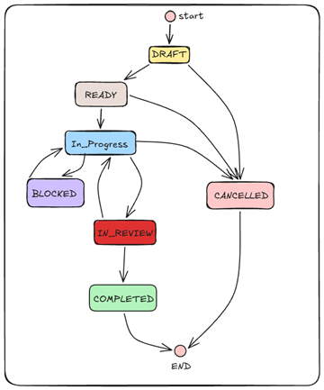
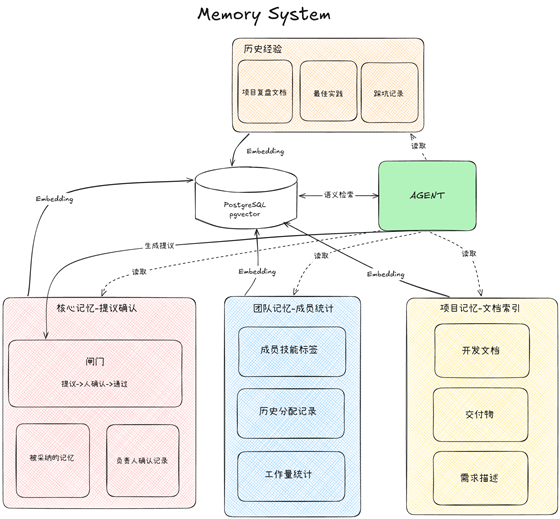

# AgentOS 架构指南

AgentOS 是多项目协作平台，采用 FastAPI 模块化单体与独立后台进程。部署操作见[发布指南](release-guide.md)，文件运维见[备份与恢复](release-guide.md#备份与恢复)。

## 系统边界

- PostgreSQL 是业务事实的权威来源。Redis 承担任务队列、延迟重试、心跳和 SSE 通道；LangGraph 检查点用于运行恢复，两者都不能替代业务记录。
- 人类决定，Agent 建议。创建工作项、变更主执行人、审批、完成和核心记忆确认由具备权限的用户通过 API 执行，模型输出不能直接触发这些业务命令。
- Worker 可以写运行结果、建议、通知、需求分析、索引和记忆提议等后台记录，但不能代替用户批准、转派或完成工作项。
- 每个工作项只有一名当前主执行人。协作请求不转移主责任；转派须经负责人批准。关键业务变更与审计事件在同一数据库事务中写入。
- 项目工作量和状态透明不等于文件正文与审核意见全部公开。资源访问必须在后端校验项目归属、成员角色及资源关系。

## 运行结构

[docker-compose.yml](../docker-compose.yml) 默认启动六个服务：

| 服务 | 职责 | 宿主机入口 |
| --- | --- | --- |
| `frontend` | nginx 提供 React 静态资源，反代 API、SSE 和健康检查 | `3000:3000` |
| `backend` | FastAPI API；启动时执行 Alembic 迁移和 bootstrap | `8000:8000` |
| `worker` | 消费 Redis 队列，运行 Agent、分析和索引任务 | 无 |
| `scheduler` | 定时投递提醒、风险扫描和提议过期任务 | 无 |
| `postgres` | PostgreSQL 16 + pgvector | `0.0.0.0:5436:5432` |
| `redis` | 队列、事件通道和心跳，开启 AOF | 无 |

MinIO 是 `minio` profile 下的可选服务，9000/9001 仅绑定宿主机回环。Ollama 或外部模型服务独立部署。backend、worker、scheduler 使用同一个后端构建目录，但以不同命令运行。

应用进程等待 PostgreSQL、Redis 健康后启动；frontend 仅等待 backend 启动，不代表迁移或业务接口已就绪。`/health` 检查数据库和 Redis，Worker/Scheduler 的健康检查读取 Redis 心跳，不保证模型、存储或所有队列任务正常。

持久化目录位于 `data/`：数据库、Redis、上传文件、日志、备份及可选 MinIO 数据。源码打入镜像，修改代码后需要重建对应镜像。端口与数据安全要求见发布指南。

## 后端模块

代码入口为 [backend/app/main.py](../backend/app/main.py)，API 前缀为 `/api/v1`。

| 目录 | 职责 |
| --- | --- |
| `backend/app/core/` | 配置、请求上下文、错误、日志及幂等控制 |
| `backend/app/api/v1/` | 领域路由装配 |
| `backend/app/domains/identity/`、`admin/`、`project/` | 全局账号与管理、项目、成员和能力 |
| `backend/app/domains/requirements/` | 项目需求、讨论、素材与分析 |
| `backend/app/domains/work_items/`、`collaboration/`、`transfers/`、`deadlines/` | 工作项、协作、转派及改期规则 |
| `backend/app/domains/dev_docs/`、`deliverables/`、`reviews/`、`handoffs/` | 开发文档门禁、版本化交付、审核及成果移交 |
| `backend/app/domains/files/`、`memory/` | 文件元数据、版本、检索、档案和核心记忆 |
| `backend/app/domains/notifications/`、`approvals/`、`audit/` | 通知、审批聚合和追加式审计 |
| `backend/app/agents/` | LangGraph 图、专家能力、提示词、工具、运行与建议 |
| `backend/app/infrastructure/` | 数据库、Redis、队列、事件、模型和存储适配器 |
| `backend/app/workers/`、`scripts/` | 后台执行与初始化、迁移、索引等运维入口 |

领域通常按 `models.py`、`schemas.py`、`router.py`、`service.py` 划分，状态机判断合法迁移，服务层负责资源权限与事务。项目需求、讨论和素材由需求域组织。Agent 编排是顶层包，不与业务领域服务混为一层。

## 身份与项目隔离

- `users.is_admin` 是全局管理员标识，独立于 `project_members.role`。项目角色是 `leader` 和 `member`；同一用户在不同项目拥有独立成员身份。
- bootstrap 幂等创建默认项目和全局管理员，不创建管理员的项目成员记录。管理员管理业务账号、项目、负责人和平台审计；仅在明确授权的接口进行项目只读监督，不因此获得项目业务写权限。
- 项目接口通过 `X-Project-Id` 解析上下文；缺失或非法 UUID 返回 400，非成员或停用成员返回 403。全局接口不要求项目成员身份。
- 对象查询限定项目，他项目对象按不存在返回 404；同项目内的权限不足返回 403。关联成员、工作项、交付物等也必须校验归属，不能只验证请求头。
- 队列任务没有 HTTP 上下文，项目归属必须经载荷或数据库父记录显式传递；Agent 工具查询和风险扫描去重同样按项目隔离。
- 密码使用 Argon2；短期 JWT 配合用户状态与令牌版本校验。Refresh Token 仅存哈希，支持轮换和撤销。公开注册和用户自助改密入口尚未提供。

实现入口：[项目鉴权依赖](../backend/app/domains/project/dependencies.py)、[bootstrap](../backend/app/scripts/bootstrap.py)。

## 业务流转与一致性

图示为审核主路径：`DRAFT → READY → IN_PROGRESS → IN_REVIEW → COMPLETED`，支持阻塞、返工和有限状态下取消。另有成果移交路径：`IN_PROGRESS → WAITING_ACCEPTANCE`，接收人确认后完成，要求补充则回到执行中。完整迁移以[状态机](../backend/app/domains/work_items/state_machine.py)为准。

- 开始开发前，开发文档须经负责人确认或明确豁免；未满足时 `start` 返回 409。Agent 文档初审只是建议，模型失败不阻塞人工确认。开发文档管理开工前方案，交付物管理完工后成果。
- 协作有独立请求与交付状态；转派审批通过才修改主执行人；协作改期是否影响主任务截止时间决定是否需要升级审批。
- 文本、Git 链接和文件交付保留版本。Git 链接不代表平台已验证外部提交、审核或合并状态。
- 需要并发保护的写路径使用行锁和 `version` 检查，版本冲突返回 409。新增命令应覆盖并发测试，不能把读取后比对版本当作完整的并发保证。
- [幂等守卫](../backend/app/core/idempotency.py)按项目、用户、方法、路径和 `Idempotency-Key` 隔离响应，数据库唯一约束抢占执行权，完成后重放首次成功响应。仅声明守卫且携带键的请求启用保护；自动重试复用同一键。
- `audit_events` 为追加式记录，保存操作者、目标、动作、变更摘要及请求标识。审计服务只 flush，由业务用例统一提交。
- API 错误包含 `code`、`message`、`request_id`、`details`；响应头 `X-Request-ID` 用于关联日志。日志不得记录密码、令牌、API Key 或文件原文。

## Agent 与后台任务

[基础图](../backend/app/agents/graphs/base.py)按加载上下文、选择能力、执行、结构校验、保存建议运行。Pydantic 输出契约包含建议内容、事实引用、置信度、风险和提示词版本；校验失败记录运行错误，不保存正式建议。PostgreSQL 检查点以运行 ID 为恢复单位。

- 工具提供授权后的只读查询和建议写入，不注册创建工作项、审批、改负责人、改截止时间、删除记录或合并代码等业务操作。
- 能力覆盖需求分析、规划、分配、风险、交付初审、摘要、开发文档初审和 `requirement_pipeline`；`echo` 用于不调用模型的管道自检。
- 需求流水线产出可编辑的拆解与人选建议，用户确认后才调用正式工作项接口。采纳建议本身不等于所有工作项已创建；逐项创建可能部分失败，不具有跨请求原子性。
- 模型通过 `ModelProvider` 适配 Ollama 或 OpenAI 兼容 API，向量模型独立配置。模型输出及检索片段均不是可信指令，只应传入当前分析必需的上下文。
- Provider 调用重试与运行级指数退避是两层机制；结构校验失败不按临时网络错误重试。人工可以重新触发失败运行。后台单任务异常被隔离，避免拖垮后续任务。
- Worker 还执行需求分析、文件索引、过期索引恢复、经验总结和提议过期。不要把“Agent 不执行业务决策”误解为“所有后台任务只能写建议表”。

## 记忆与检索

记忆由项目文档、成员统计与档案、项目核心记忆、历史与经验组成。文本提取、切块、embedding 与 pgvector 检索由 `domains/memory/` 和后台索引任务协作完成。

- 文档按版本保留，检索只使用当前有效版本及匹配模型的向量块。文本、Markdown、文字型 PDF 和 DOCX 可提取；图片、压缩包不作 OCR。索引失败独立于文件上传成功。
- 项目文档、核心记忆和历史按项目隔离。成员统计按项目计算；成员文字档案按用户存储，是明确的跨项目例外，跨项目检索仅向负责人查询与内部分配开放，普通成员问答不检索档案。档案详情另有成员及管理员只读入口，编辑由目标成员所属项目的负责人执行。
- 核心记忆提议需负责人确认才生效，负责人可直接维护条目；容量预算限制常驻上下文，待确认提议超过七天过期。经验总结也走提议确认，不自动成为生效规则。
- 知识库问答与 Agent 共用有权限控制的检索路径。有可靠依据才生成答案并附来源；相似度不足时拒答并给出线索。问答历史按用户保存，查询不写入业务审计。
- embedding 列固定为 1024 维。同维度换模型也需要重建索引；维度变更需要专门数据库迁移。检索故障时部分 Agent 能降级为无记忆分析，知识库问答则不能在无依据时生成答案。
- 文件没有产品删除入口。敏感文件处置应走受控运维流程；仅把索引块设为非当前不能撤销下载、外部模型已接收的数据或阻止后续重建，不能当作完整下架方案。

权限入口：[search.py](../backend/app/domains/memory/search.py)；问答行为：[qa.py](../backend/app/domains/memory/qa.py)。

## 文件存储

业务通过 `StorageProvider` 访问 local 或 MinIO。数据库保存后端和相对 key，不保存宿主机绝对路径；上传目录不直接由 nginx 暴露，下载统一经过 API 权限检查。

- `STORAGE_BACKEND` 仅决定新文件去向，历史文件按自身记录选择后端。切换配置不能替代数据迁移，旧后端与卷须保持可访问。
- 新文件 key 包含项目与文件版本 ID；`directory_path` 是逻辑目录，版本按项目、目录和文件名归组，逻辑目录不改变 RAG 权限范围。
- 上传校验大小、类型和 SHA-256，经暂存、发布再提交数据库。数据库与存储不是分布式事务；确定失败时补偿，提交结果不确定时保留对象供对账，强制中止可能留下孤儿对象。
- 迁移保持 ID、key 和版本，复制并校验后才更新后端标记，保留源文件。备份须同时包含数据库和全部登记文件，覆盖历史版本、需求素材及 local/MinIO 后端。

## 前端与实时更新

前端使用 React、TypeScript、Vite、React Router、TanStack Query、Zustand 和 Tailwind。基础 UI 使用 `components/ui/` 中的 shadcn/ui 组件，表单使用 react-hook-form 与 zod，反馈使用 Sonner。

- `src/app/` 管理路由与会话，`features/` 按业务组织页面，`services/api.ts` 统一认证、刷新令牌、错误和项目请求头。
- 全局管理员进入管理控制台，普通账号选择项目后加载成员身份。缓存键包含项目维度，切换项目不能复用其他项目的业务缓存。
- SSE 使用 token 与 `project_id` 查询参数建立事件流，按成员通道推送并使相关查询缓存失效；所有写操作走 REST。代理和日志应避免记录 URL 中的令牌。
- 事件在数据库提交后发布；Redis 推送失败不能回滚业务事务。SSE 不提供历史事件补发，应通过重新查询和持久化通知恢复界面状态。

## 测试边界

后端以 pytest、httpx 的 HTTP API 接缝验证项目隔离、鉴权、状态流转、幂等、审计及 Agent 护栏；纯状态机与权限规则另有单元测试。多项目用双项目场景验证跨项目对象 404、非成员 403、幂等不串项目及后台归属。模型测试使用替身，不以真实 LLM 结果作为确定性断言。

`backend/tests/conftest.py` 使用 `_test` 后缀数据库并执行迁移，每例清理业务表；Redis DB 0 默认改为 15，显式非零 DB 保留。测试环境和并行任务须各自使用专用数据库及 Redis DB，不能连接生产资源。

前端 Vitest 验证组件及角色、项目切换流程，生产构建包含 TypeScript 检查。测试命令见[README](../README.md#开发与测试)，具体运行结果应以当前验证为准。
